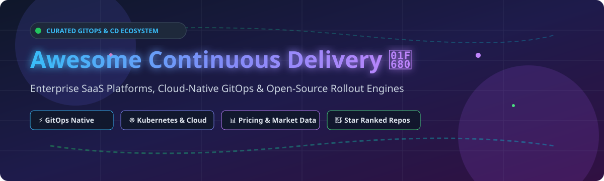

  

# 🚀 Awesome Continuous Delivery (CD) Ecosystem

  
  
  
  

---

## 📌 Executive Overview & Market Landscape

The global **Continuous Delivery (CD) & Release Automation Market** is estimated at **$3.2 Billion (2026)** and is projected to expand at a CAGR of **18.4%** to reach **$7.5 Billion by 2030**. 

Market fragmentation is **moderately fragmented**: major cloud providers (Microsoft Azure, Google Cloud) command substantial market share via bundled cloud platforms, while specialized enterprise leaders (Harness, Octopus Deploy, GitLab) capture high-value multi-cloud enterprise workloads. Simultaneously, open-source GitOps engines (Argo CD, Flux) function as the foundational open standard across Kubernetes deployments.

---

## 📚 Table of Contents

- [☁️ SaaS & Hosted Continuous Delivery Platforms](#%EF%B8%8F-saas--hosted-continuous-delivery-platforms)
- [🔓 Open-Source GitHub Projects](#-open-source-github-projects)
- [🤝 How to Contribute](#-how-to-contribute)
- [💖 Support & Sponsorship](#-support--sponsorship)
- [📈 Star History](#-star-history)
- [⚠️ Disclaimer](#%EF%B8%8F-disclaimer)

---

## ☁️ SaaS & Hosted Continuous Delivery Platforms

| Company / Product | Size / Valuation / Revenue | Starting Paid Price | Free Tier Limits | Key Features & Capabilities |
| :--- | :--- | :--- | :--- | :--- |
| **[Azure DevOps Pipelines](https://azure.microsoft.com/en-us/products/devops/pipelines)** | **$3.1T Market Cap** (Parent: Microsoft) | **$6 per user/month** (Parallel job addons at $40/mo) | 1800 free compute minutes/month with 1 free parallel job | Multi-platform enterprise pipelines with deep Azure integration and approvals. |
| **[Google Cloud Deploy](https://cloud.google.com/deploy)** | **$2.1T Market Cap** (Parent: Alphabet) | **$15 per active delivery pipeline/month** | 1 active delivery pipeline per month free | Fully managed CD service for GKE, Cloud Run, and Anthos with automated rollouts. |
| **[GitLab CD](https://about.gitlab.com/stages-devops-lifecycle/continuous-delivery/)** | **$8.1B Market Cap** ($955M ARR) | **$29 per user/month** (Premium tier) | 400 compute minutes/mo, 5 users max, 10 GiB storage | Integrated DevOps lifecycle platform with built-in pipelines and environment management. |
| **[Harness](https://www.harness.io/)** | **$5.5B Valuation** (~$295M ARR) | **$100 per developer/month** (Essentials plan) | 2,000 cloud credits/mo, 10 GB storage, 50 GB bandwidth | AI-native enterprise CD platform with automated canary verification and cost governance. |
| **[Octopus Deploy](https://octopus.com/)** | **~$83M ARR** (Insight Partners backed) | **$10 per target/month** ($360/year base) | 10 Projects, 10 Targets, 10 Tenants, 10 Users max | Dedicated release orchestration, complex approvals, and hybrid cloud/on-prem deployment automation. |
| **[Codefresh](https://codefresh.io/)** | **~$40M - $50M Valuation** (Acquired by Octopus) | **$99 per user/month** (Pro plan) | 1 concurrent build job, 1 seat, community support | Kubernetes-native CI/CD and GitOps platform powered by Argo workflows. |
| **[Akuity (Managed Argo CD)](https://akuity.io/)** | **$25M Total Funding** (Private) | **$495 per month** (Pro tier) | 14-day full feature free trial | Enterprise-managed control plane for Argo CD with multi-cluster security and insights. |

*Note: SaaS product details, limits, and pricing structures are presented above with explicit free tier and starting tier information as of late 2026.*

---

## 🔓 Open-Source GitHub Projects

Curated open-source projects for declarative GitOps, pipeline automation, and progressive delivery, ordered by GitHub star counts (descending):

- **[Helm](https://github.com/helm/helm)**  
    
  The package manager for Kubernetes—enables reproducible deployment templates, release management, and chart versioning across environments.

- **[Argo CD](https://github.com/argoproj/argo-cd)**  
    
  Leading CNCF declarative GitOps continuous delivery tool for Kubernetes—syncs state from Git and provides a powerful Web UI.

- **[Dagger](https://github.com/dagger/dagger)**  
    
  Programmable CI/CD engine that runs pipelines in containers, allowing delivery workflows to be written in standard programming languages.

- **[Kustomize](https://github.com/kubernetes-sigs/kustomize)**  
    
  Template-free customization of Kubernetes YAML configurations enabling declarative, environment-specific CD overlays.

- **[Spinnaker](https://github.com/spinnaker/spinnaker)**  
    
  Multi-cloud continuous delivery platform developed by Netflix and Google for high-velocity enterprise software releases.

- **[Tekton Pipelines](https://github.com/tektoncd/pipeline)**  
    
  CNCF cloud-native pipeline framework for building custom CI/CD systems on top of Kubernetes CRDs.

- **[Flux v2](https://github.com/fluxcd/flux2)**  
    
  Open and extensible GitOps toolkit for Kubernetes, supporting automated image updates and multi-tenant delivery.

- **[Woodpecker CI](https://github.com/woodpecker-ci/woodpecker)**  
    
  Simple yet powerful community-driven container-based CI/CD engine designed as a lightweight open-source alternative.

- **[GoCD](https://github.com/gocd/gocd)**  
    
  Open-source continuous delivery server focused on modeling, automating, and visualizing complex deployment pipelines.

- **[Flagger](https://github.com/fluxcd/flagger)**  
    
  Progressive delivery operator that automates canary releases, A/B testing, and blue/green rollouts using service mesh telemetry.

- **[DevSpace](https://github.com/devspace-sh/devspace)**  
    
  Client-only developer tool for Kubernetes that automates building, testing, and deploying cloud-native applications.

- **[Werf](https://github.com/werf/werf)**  
    
  GitOps CLI tool that glues Git, Docker/Buildah, Helm, and Kubernetes together for continuous delivery pipelines.

- **[Jenkins X](https://github.com/jenkins-x/jx)**  
    
  Automated CI+CD for Kubernetes with automated preview environments and GitOps management.

- **[Argo Rollouts](https://github.com/argoproj/argo-rollouts)**  
    
  Kubernetes Controller providing advanced deployment capabilities such as Canary, Blue-Green, and Automated Metric Analysis.

- **[Keptn](https://github.com/keptn/keptn)**  
    
  Event-driven control plane for cloud-native application lifecycle orchestration and automated quality gates.

- **[PipeCD](https://github.com/pipe-cd/pipecd)**  
    
  Unified GitOps CD platform for declarative Kubernetes, serverless (Lambda/Cloud Run), and infrastructure deployments.

---

## 🛠️ Frameworks & Architecture Patterns

1. **Kubernetes GitOps Architecture**: Store application manifests in Git $\rightarrow$ reconcile cluster state with **Argo CD** or **Flux v2**.
2. **Progressive Delivery & Safe Release**: Automated canary analysis and traffic splitting via **Argo Rollouts** or **Flagger**.
3. **Cloud-Native Automation**: Containerized pipeline construction using **Tekton** or **Dagger**.
4. **Hybrid / Enterprise Governance**: Enterprise policy execution and approval pipelines integrated via **Harness** or **Octopus Deploy**.

---

## 🤝 How to Contribute

Contributions are welcome! Please follow these simple guidelines:

1. Fork this repository.
2. Edit `README.md` with your new entry.
3. Include the project name, official URL, description, category, and pricing/star metadata.
4. Open a Pull Request detailing your additions.

---

## 💖 Support & Sponsorship

If you find this repository helpful, please consider supporting the project!

- 🌟 **Star** this repository to show your appreciation.
- 🔀 **Fork** and share with your DevOps team & colleagues.
- ☕ **Buy Me a Coffee / Sponsor**: Support ongoing maintenance via the [GitHub Sponsor Dashboard](https://github.com/sponsors/ishandutta2007).

---

## 📈 Star History

---

## ⚠️ Disclaimer

This list is community-curated for informational purposes only and does not constitute formal technical advice or commercial endorsement. Test deployment configurations in non-production environments before enterprise adoption.
